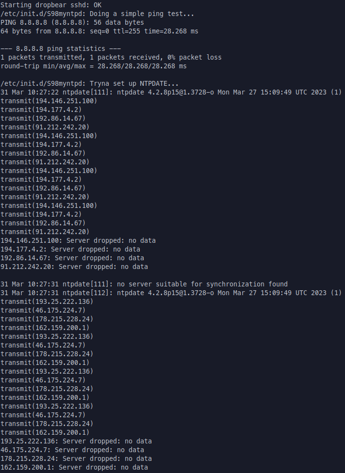

# Linux for Embedded Systems – Laboratory ex. 1

Warsaw 31.03.2023  

Student: Emmanuel Katwikirize  

## Description of the assignment
- The system should use Initramfs (Initial ramdisk) as its root filesystem.
- The root password should be set.
- The system should be equipped with an ssh server (preferably dropbear, as it is easy to configure). It should be possible to log in to the system from the network.
- The standard "Welcome to Buildroot" message displayed at the start of the system should be replaced with your customized message, containing your name and last name.
- The date and time in the system should be set automatically from an NTP server.
- The system should contain the interpreter of the script language: Python.
- The system should contain the script written in that language that performs the following action: When the system boots and when it is shut down, the script sends an e-mail notifying about that fact. (Please read the documentation about running the scripts at the starting and stopping of the system. Analysis of the scripts in /etc/init.d in the generated system may help to understand how those scripts are run.)

## Procedure to recreate the design from the attached archive
The archive can be unpacked and a symlink to the `overlay` directory can be created within the user's `./buildroot-...` directory.  
`./lab1.rpi.config` can be copied to the user's `./buildroot-...` directory and renamed to `.config`  
The user can then run `make menuconfig` and save, then `make`.

## Description of the solution
### <u>Config</u>
I configured the system to use initramfs  
I set the root password  
I enabled the dropbear package  
I changed the Buildroot startup message  
I enabled the python3 package, and I enabled it to be compiled with SSH  
I enabled the ntp package and in it's submenu, ntpdate, then I created a simple script to run ntp at startup  
Details of the config are in the next section

### <u>Startup/Shutdown scripts</u>
I created an email function in python. I created a python script for startup and shutdown, and used the email function to send emails from them.  
I created a simple shell script (using [an example in the buildroot manuals](https://buildroot.org/downloads/manual/manual.html#adding-packages-start-script) for reference) to have the python scripts run at startup and shutdown  
These scripts didn't truly run as daemons since I only used the start script to run them a single time at startup, and a single time at shutdown, each time they would simply exit once the email is sent   
An alternate solution may have been to use cron, or to use a truly long running python script as a legitimate daemon, or (at least for NTP) to use the package's daemon  
Regardless, the emails were sent correctly at startup and shutdown  
Both scripts started by using a very simple ICMP echo request function to Google's DNS as a rudimentary check for network connectivity  
My NTP and Python scripts were all overlayed onto the /etc/init.d directory  
More details of how I configured the overlay are in the next section

## Description of the modifications of BR and kernel configurations
### Buildroot Configuration
#### <u>Toolchain/CCache</u>
- I set `BR2_CCACHE=y` to enable use of a compiler cache
- During the lab, I set `BR2_CCACHE_DIR="/malina/katwikirizee/ccache-br"`  
I used our lab's malina directory to have a reasonable disk access speed
- I set `BR2_TOOLCHAIN_EXTERNAL=y` to auto-download and use an existing cross-compilation toolchain  
I did not change the default external toolchain (Arm AArch64 2021.07)  

#### <u>Primary download site</u>
- During the lab, I set `BR2_PRIMARY_SITE="http://192.168.137.24/dl"` to set the primary site that buildroot would download from

#### <u>Overlay</u>
- I set `BR2_ROOTFS_OVERLAY="overlay"`, a symlink to a folder containing folders to be overlaid onto the root filesystem

#### <u>initramfs</u>
- I set `BR2_TARGET_ROOTFS_INITRAMFS=y` to enable initramfs
- I set `BR2_TARGET_ROOTFS_EXT2_SIZE="512M"` because the default size was too small

#### <u>Root password</u>
- I set `BR2_TARGET_GENERIC_ROOT_PASSWD="..."`

#### <u>Welcome message</u>
- I set `BR2_TARGET_GENERIC_ISSUE="Welcome! - Emmanuel Katwikirize"`

#### <u>Dropbear</u>
- I set `BR2_PACKAGE_DROPBEAR=y` to enable the dropbear package  
The default settings seem to create an S50dropear daemon in /etc/init.d  
this seems to be enough to have a server to ssh into, I didn't configure it further

#### <u>Python</u>
- I set `BR2_PACKAGE_PYTHON3=y` to enable the python language interpreter to be compiled
- I set `BR2_PACKAGE_PYTHON3_SSL=y` to enable the _ssl module to be compiled for python, this was needed for secure connections via SMTP, for the emails.

#### <u>NTP</u>
- I set `BR2_PACKAGE_NTP=y` to enable the Network Time Protocol suite/programs
- I set `BR2_PACKAGE_NTP_NTPDATE=y` to enable the ntpdate utility program to set the loca time/date from an NTP server

## Description of the system testing
I used the `start-qemu.sh` script (placed in the /buildroot/output/images/ directory) to test the system in Qemu, using my lab1.qemu.defconfig  

I omit the usual chatter from the kernel ring buffer.  
The first message from something I configured is from dropbear announcing that sshd was successfully started:  
  
The above screenshot also shows S98myntpd testing whether the network is available with a simple ping, which is successful  
It then tries a couple NTP servers and fails. This is a known issue within some PW networks.  
The script was confirmed to work during the actual lab.  

The following screenshot shows S99myemailerd testing the network as well, then announcing that it sent the startup email.  
We can see that the overlay folder indeed works correctly when we look into /etc/init.d  
The following screenshot also shows the adjusted welcome message, and me being prompted for a password.  

On the host machine (my home laptop) I test that I can ssh into the system as root  
I SSH into 2222 because that's how I mapped the forwarding of the ports in the Qemu script, the server is running on port 22 though.  

Back on the system, I test that I can use the python interpreter, and that powering off the system sends the shutdown email as required  

The script spams.  

