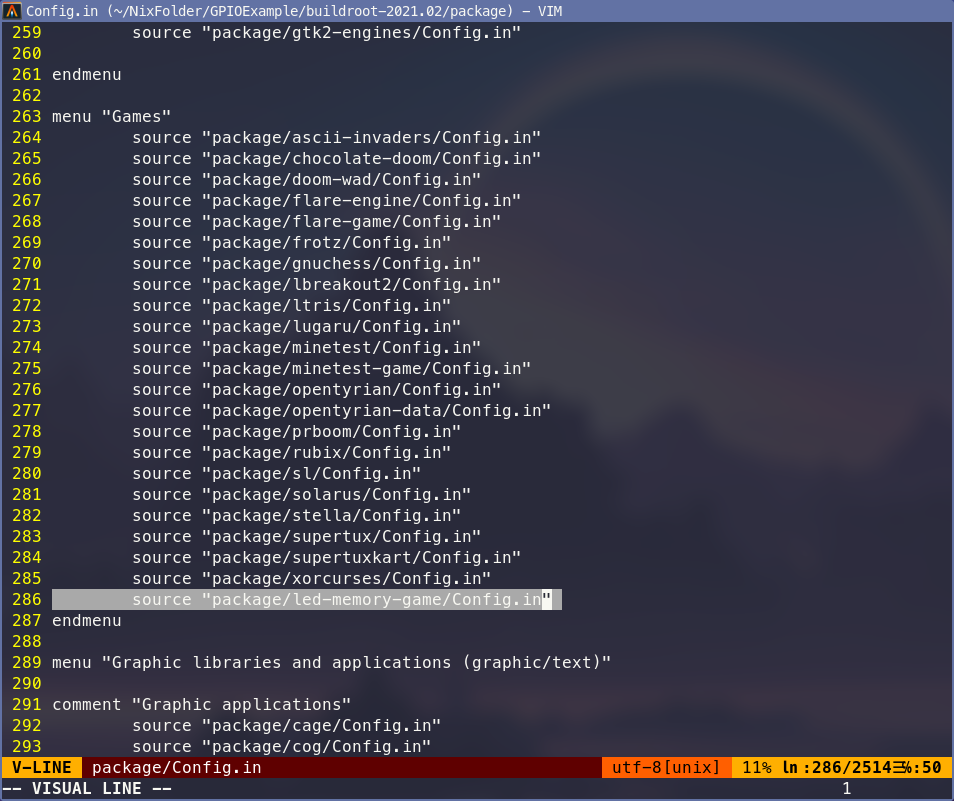
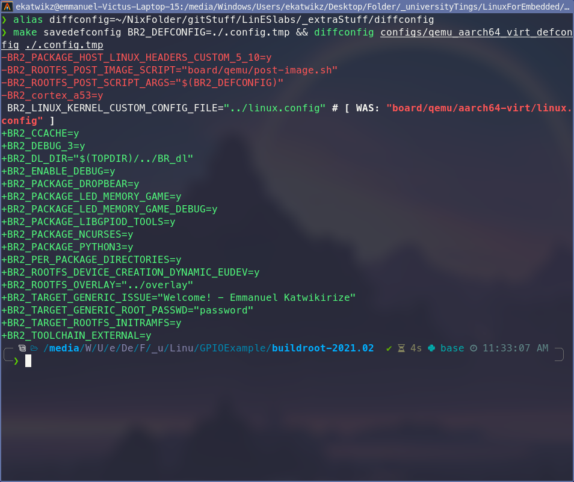
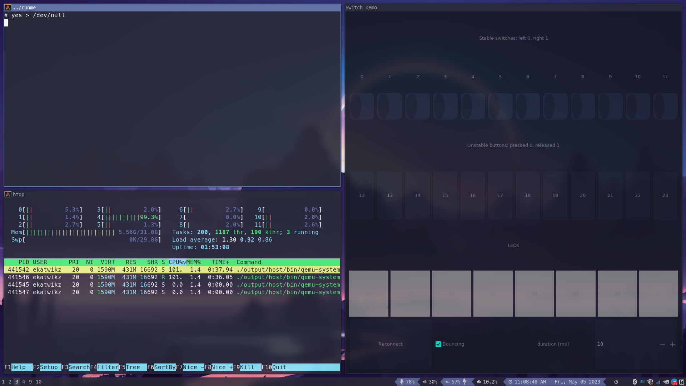
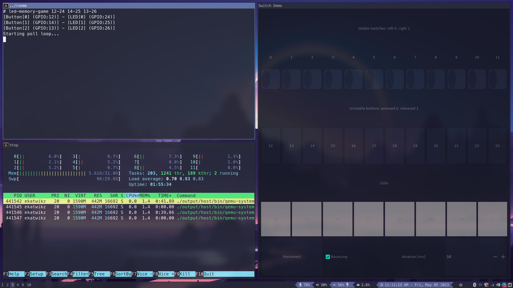
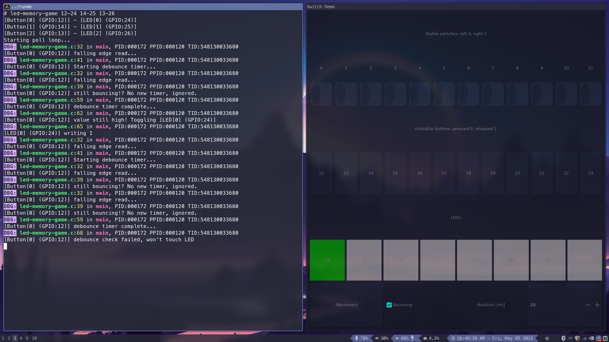
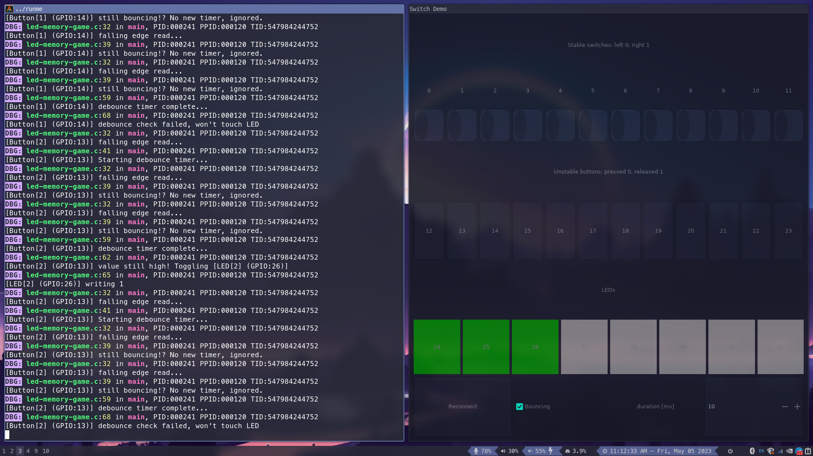
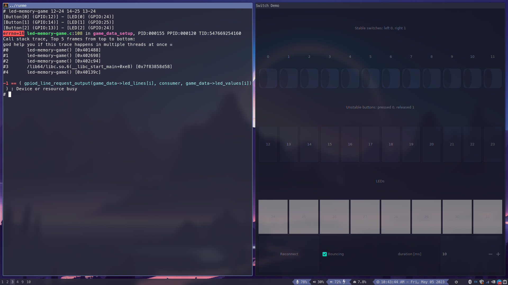
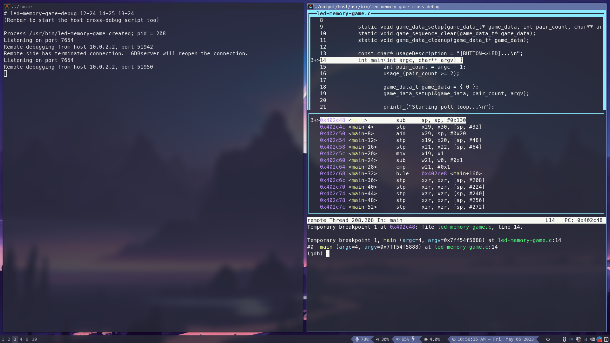
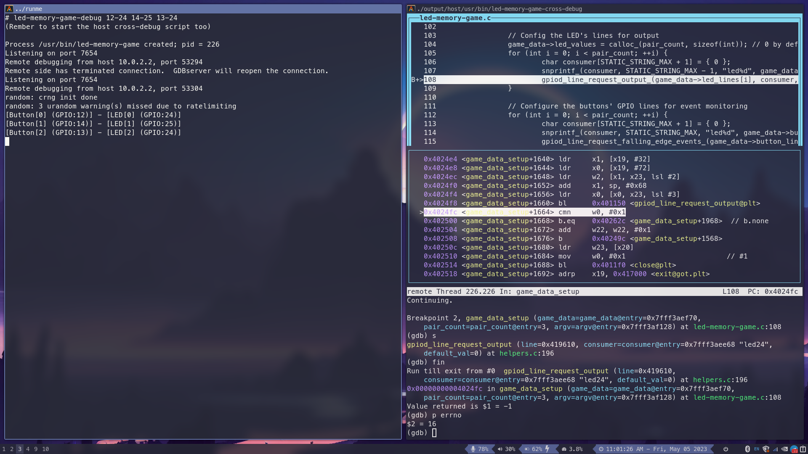

# Linux for Embedded Systems – Laboratory ex. 2

Warsaw 04.05.2023  

Student: Emmanuel Katwikirize  

## Description of the assignment
- Prepare an application in a compiled language (C or C++ preferred, make
sure that the chosen language is supported in BR), which uses the buttons
and LED diodes. When reading the buttons, please take into consideration
the „contact bounce” effect.
- It is required that the application implements thorough error checking
(you can’t assume that e.g., all hardware communication functions always
succeed).
- The application must respond to changes in the state of the buttons
without active waiting (should sleep waiting for the required change)
- The application functionality should be defined by the student (below are
just examples):
    1. The timer controlled by the buttons (with lap-time function); LEDs
    should be used to confirm the operation. The measured time should be
    displayed on the console.
    2. Coded lock with tampering detection; LEDs should signal the opening of
    the lock, an erroneous code, alarm state after the certain number of
    unsuccessful attempts.
    3. **"Memory game"; application displays a sequence using the LEDs. The user
    must repeat it with the buttons.**
    4. Application for simple tests; The questions (read together with the
    right answers from an external file) are displayed in the console. The
    user answers with the buttons. After each response, the LEDs signal:
    good answer, wrong answer, skipped question. At the end, the result is
    displayed in the console.
    5. Reaction speed tester; The user must press the button corresponding to
    the lit LED. The application measures the delay and at the end presents
    the statistics.
    6. Morse code transmitter and receiver; The LED transmits the text sent by
    the console. The text entered by the switch is decoded and output to
    the console).
- The application should be converted into the Buildroot package
- The student should demonstrate debugging of his application with the gdb
debugger
- Additional task: Prepare the equivalent application in a selected script
language (Python? Lua?) and compare both implementations (resource usage -
the application itself and the application + required libraries and/or
interpreters, event handling time - measured by a system call and saved to
a file).

## Procedure to recreate the design from the attached archive
The archive can be unpacked and a symlink to the `overlay` directory can be created within the user's `./buildroot-...` directory.  
`./lab2.rpi.config` can be copied to the user's `./buildroot-...` directory and renamed to `.config`  
The folder `br2-package` within the submodule led-memory-game should be symlinked to (and renamed `led-memory-game`) from within the packages folder.  
The line `source "package/led-memory-game/Config.in"` should be added to buildroots `./package/Config.in` under the `menu "Games"` section, the following image shows an example.    
  
The user can then run `make menuconfig` and save, then `make`.

## Description of the solution
### <u>Config</u>
I set the system to be built with initramfs.  
I enabled debug symbols to be built into packages.  
I set the debug level to 3.  
I selected dropbear.  
I selected python3.  
I set the overlay path.  
I selected the game from the menu.  
I selected the `BR2_PACKAGE_LED_MEMORY_GAME_DEBUG` suboption I created from it, which automagically selects additional options which are used for debugging.  

The following image shows a script of mine outlining the resulting configuration.
  

Details of the config are in the next section.

### <u>led-memory-game</u>
I used the [libpgiod v1.6](https://git.kernel.org/pub/scm/libs/libgpiod/libgpiod.git/tree/include/gpiod.h?h=v1.6.x) library to create the program.  
I used some of my own old macros from [katwikOpsys.h](https://github.com/Ekatwikz/katwikOpsys/blob/974d51f/errorHelpers.h#L142-L148) to make sure that the library calls were checked for failure.  
The program currently implements just the main necessary proof of concept part.  
There is a struct that organizes all the game's data, which is dynamically allocated to accomodate selecting arbitrary pairs of buttons and LEDs.  
It contains the GPIO lines, button event descriptors, timer descriptors for debouncing each button, pollFDs for polling the descriptors, and additional information.  
The data is intialized and freed using a pair of helper functions I added.  
After initializing, there is an infinite loop that [`poll`](https://www.man7.org/linux/man-pages/man3/poll.3p.html)s the descriptors of the buttons and timers.  
If we receive a falling edge event for the button, we check the button's respective timer, and if the timer isn't at zero, we conclude that the signal is still bouncing and we ignore the event, otherwise we start its debounce timer.  
When we recieve a timer event, we check the level of the button, and toggle the LED accordingly.
Messages are printed for each event.  
All additional reactions to button presses would be handled in this seciton for the timer.
There is no busy waiting.  

### <u>led-memory-game-debug</u>
I created a small set of scripts that start the GDB server on the client, start the cross debugger on the host, and run some gdb commands to initialize the session, for convenience.  
These make debugging the application easier.  
They are automatically installed when the `BR2_PACKAGE_LED_MEMORY_GAME_DEBUG` suboption is selected.  

## Description of the modifications of BR and kernel configurations
### Buildroot Configuration
#### <u>Debug symbols</u>
- I set `BR2_ENABLE_DEBUG=y` to enable packages to be built with debug symbols, so that libraries and binaries in staging have debug symbols. This makes remote debugging possible.
- I set `BR2_DEBUG_3=y` to include extra debug information.

#### <u>led-memory-game</u>
- I set `BR2_PACKAGE_LED_MEMORY_GAME=y` which selects `BR2_PACKAGE_LIBGPIOD=y`
- I set `BR2_PACKAGE_LED_MEMORY_GAME_DEBUG=y` which selects:  
`BR2_PACKAGE_GDB=y`  
`BR2_PACKAGE_GDB_SERVER=y`  
`BR2_PACKAGE_HOST_GDB=y`  
`BR2_PACKAGE_HOST_GDB_TUI=y`  

#### <u>Overlay</u>
- I set `BR2_ROOTFS_OVERLAY="overlay"`, a symlink to a folder containing folders to be overlaid onto the root filesystem.  
This contains test scripts copied from the example virtual system.

#### <u>initramfs</u>
- I set `BR2_TARGET_ROOTFS_INITRAMFS=y` to enable initramfs  
The package installs the `led-memory-game-update` script on the target, which can be used to download the newest version of the binary, which I would rsync to my http page after compiling.  
This somewhat streamlined the edit-compile-test cycle, both in Qemu and on the RPi.

## Description of the system testing
I used the `runme` script provided by the example virtual system to test the system.  
I also used the `gui3.py` script provided by the example system to emulate the buttons and LEDs.  

I first emulated how busy waiting would've looked like to the process viewer  
  

I then started the program and confirmed that it does not actually busy wait when listening  
  

I then pressed a button to show my logs of how the bouncing is reacted to, and handled correctly.  
  

I then pressed two more buttons to toggle the other LEDs.  
The LEDs can also be toggled off, as shown in the code, but not in this image.  
  

I then started the program incorrectly to show that the program handles all errors by terminating with a clear error message.  
  

I then simply append `-debug` to the same command to start the debug server script for the program.  
I also start the cross debugger script on the host.  
  

  
Where I used the following gdb commands in the screenshot above to explore the code around where the library returns an error:
```
b 108
c
c
c
s
fin
p errno
```

