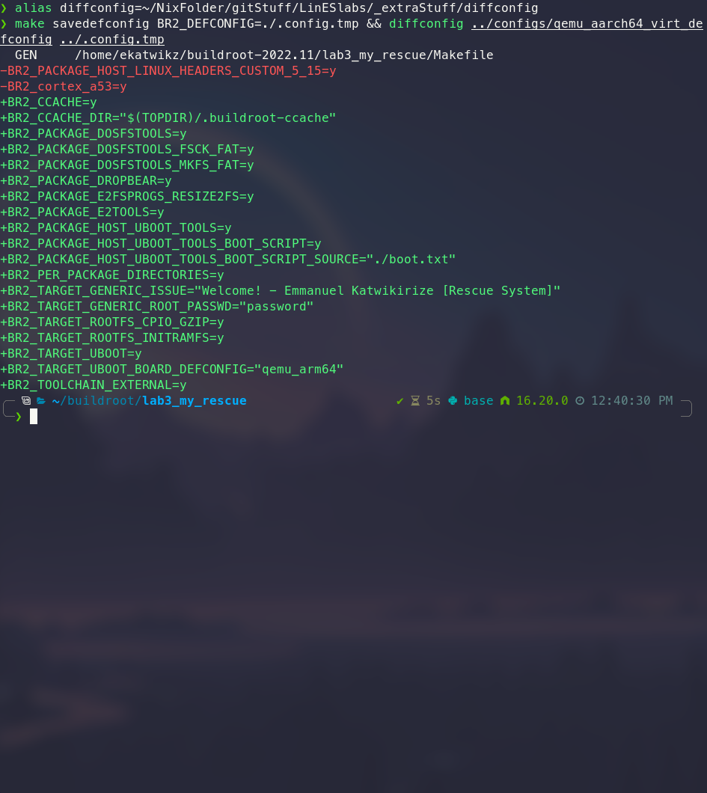
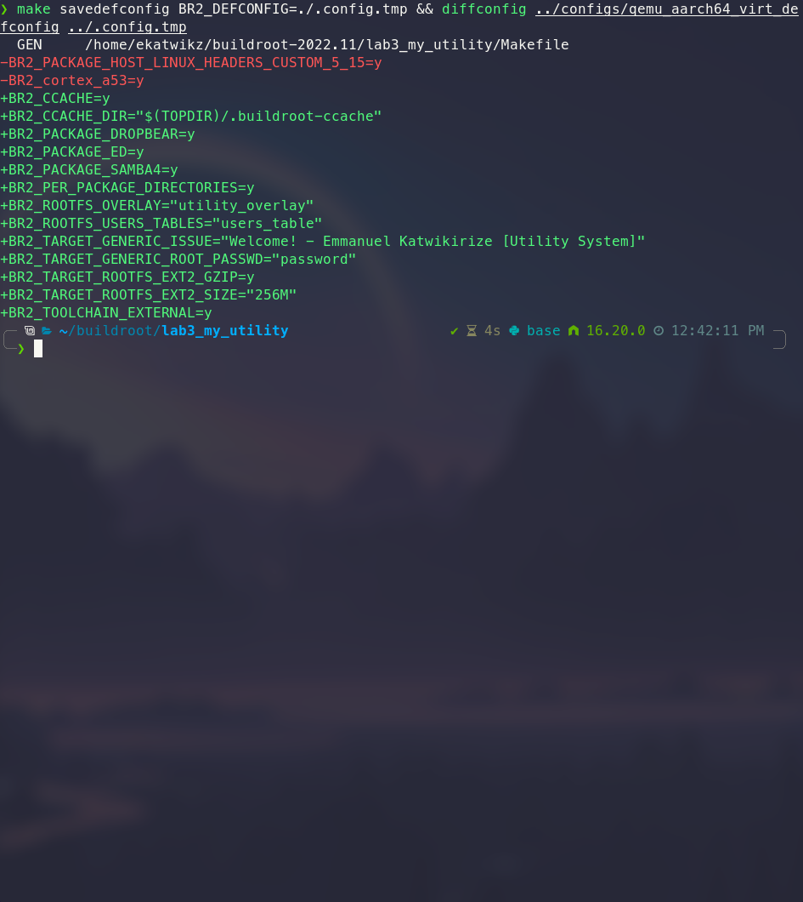
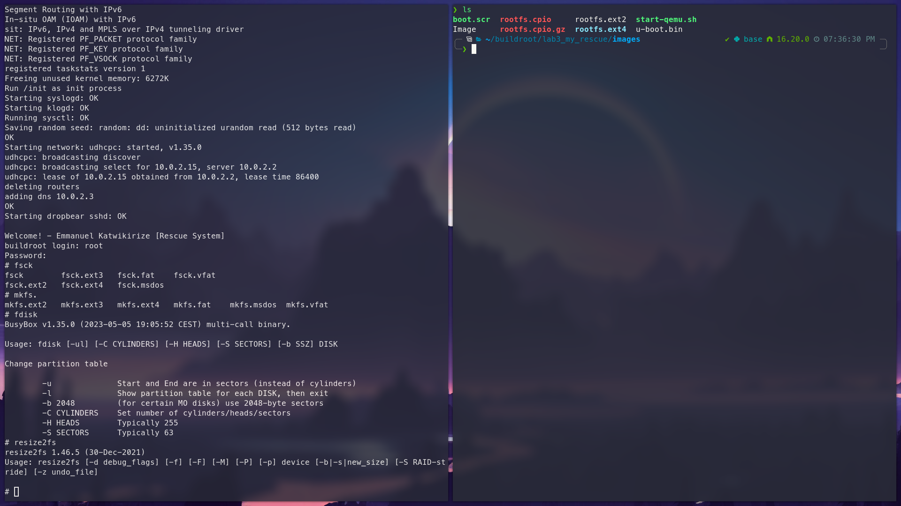
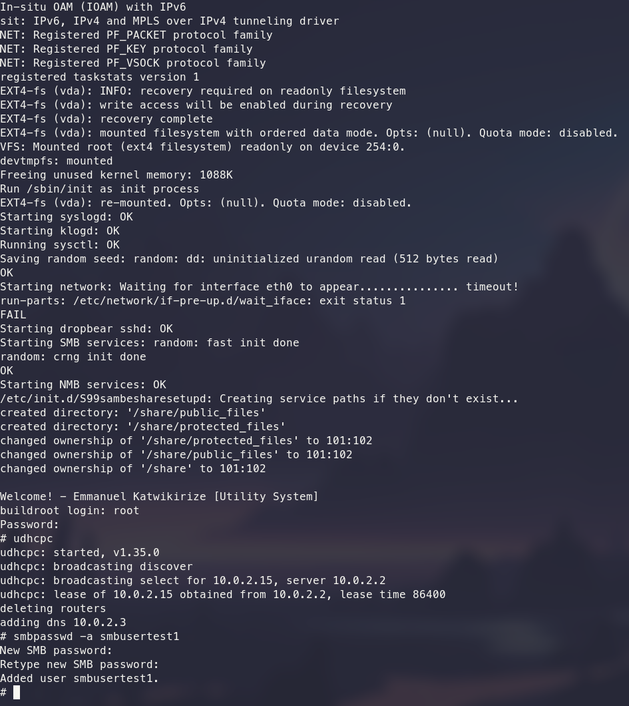
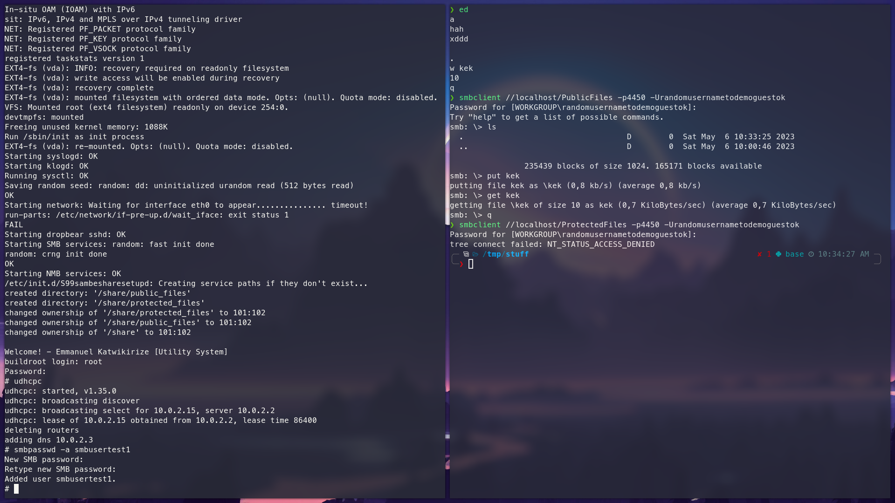
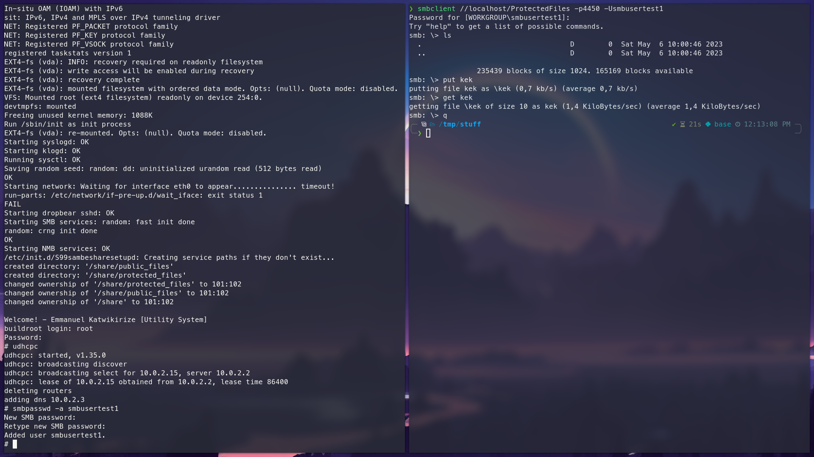

# Linux for Embedded Systems – Laboratory ex. 3

Warsaw 06.05.2023  

Student: Emmanuel Katwikirize  

## Description of the assignment
- Prepare the "administrative" Linux system similar to the "rescue" system
used in our lab:
    - working in initramfs
    - equipped with the tools necessary to manage the SD card (partition it,
    format it, copy the new version of the system via a network, etc.).  
    Particularly this system will be used to split the SD card into 3
    partitions:
        - VFAT with the rescue system (in "rescue" subdirectory), the
        administrative system and the kernel of the user system (in the
        "user" subdirectory) (in fact, it should be the original first
        partition),
        - ext4 – with the rootfs of the user system,
        - ext4 – with the data of the user system.`
- Prepare a "utility" Linux operating system using the ext4 on the 2nd
partition as its root file system. This system should provide ONE
functionality SELECTED from the list below:
    - **Network file server (e.g., SMB/CIFS) serving the filesystem on the 3rd
    partition of the SD card as a network drive.  
    The server should support creating user accounts and user authentication.**
    - The web server (based on one of HTTP servers offered by Buildroot or
    implemented as a WebApp with Flask, Tornado, or equivalent framework).  
    The server should serve files located on the 3rd partition (displaying
    the list of files and allowing selecting the file to download).  
    The server should allow the authenticated users to upload new files to the
    3rd partition.
    - Server of a selected instant messaging protocol.  
    The server should support creating user accounts and chatting between the
    logged-in users.
- Prepare the bootloader enabling selecting between the administrative and
the user system.  
Cautions! That bootloader should be started by the
original bootloader based in the RPi firmware.  
It should be run as its
user system.  
Due to limitations of the RPi, our bootloader must pass to
the loaded kernel the kernel parameters and the device tree provided by
the original bootloader.  
    - The WHITE (OR YELLOW) LED should signal, that the buttons will be
    checked
    - After one second, the buttons should be read to select the system.  
    If the chosen button is NOT pressed, the "utility" system should be
    loaded.  
    If the chosen button is pressed, the "administrative" system should be loaded.  
    - After selection of the system, the WHITE (OR YELLOW) led should beswitched off.  
    The GREEN LED should be ON if the "utility" system was selected.  
    The RED LED should be ON if the "administrative" system was selected.  

## Procedure to recreate the design from the attached archive
The archive should be unpacked and a symlink to the `utility_overlay` directory can be created within the user's `buildroot-...` directory.  
The `./boot.txt` script and `./users_table` and should be linked/copied to the user's `buildroot-...` directory.  

The user can run `make O=lab3_my_utility` and `make O=lab3_my_rescue` to initialize the two output directories.  
This will not yet actually start the build, as there are no configs yet.  

`./lab3.rpi.my_rescue.config` should be copied to the generated `buildroot-.../lab3_my_rescue` folder.  
`./lab3.rpi.my_utility.config` should be copied to the generated `buildroot-.../lab3_my_utility` folder.  
The user can `cd` into `buildroot-.../lab3_my_rescue`, run `make menuconfig` and save, then run `make` to start building the rescue system.  
In a new terminal, `buildroot-.../lab3_my_utility` can be built in parallel in the same way.  

The uboot script expects the rescue system's Image to be renamed to `ImageLab3MyRescue` and the utility system's Image to be renamed to `ImageLab3MyUtility`.  

## Description of the solution
### <u>Config (Rescue System)</u>
The following screenshot shows my script outlining the changes between the rescue system and the Qemu Aarch64 defaults.  
  
The main changes for the RPi are similar.

### <u>Config (Utility System)</u>
The following screenshot shows my script outlining the changes between the utility system and the Qemu Aarch64 defaults.  
  
The main changes for the RPi are similar.

### <u>Samba</u>
I made a generic samba configuration:  
- with `USER` as the securty setting  
- with `map to guest=Bad User` to treat non-exist usernames as a logon to the guest user  
- with the order of naming services to use as `bcast host`  

I then also included a separate configuration for the shares,  
with the main difference between the two shares' configuration being that `PublicFiles` is accisble by logging in as a guest,  
while `ProtectedFiles` isn't.

I added an fstab to automatically mount partition 3 onto the /share directory.  
I also added a simple pseudo-daemon script to create the shares' subdirectories (if they didn't exist) whenever the utility system started,  
and to `chown` them.

### <u>U-Boot</u>
I used the boot script provided in the lectures, with the modifications that:
- All the LEDs were cleared at the start of the script
- The yellow LED (for the utility system) and the red LED (for the rescue system) would both be on initially.
- If SW3 was pressed, then the rescue system would be booted, and the yellow LED would be cleared.
- +(vice versa for the utility system)

## Description of the modifications of BR and kernel configurations
### Buildroot Configuration (Rescue System)
#### <u>U-Boot</u>
- I set the `BR2_TARGET_UBOOT=y` to build the "Das U-Boot" bootloader.
- I set `BR2_TARGET_UBOOT_BOARD_DEFCONFIG="..."` depending on the system.
- I set `BR2_PACKAGE_HOST_UBOOT_TOOLS=y`,  
`BR2_PACKAGE_HOST_UBOOT_TOOLS_BOOT_SCRIPT=y` and  
`BR2_PACKAGE_HOST_UBOOT_TOOLS_BOOT_SCRIPT_SOURCE="./boot.txt"`  
to let buildroot compile the boot script for me.

#### <u>dosfstools</u>
- I set the `BR2_PACKAGE_DOSFSTOOLS=y` option to add tools for creating and checking DOS FAT filesystems.
- I set `BR2_PACKAGE_DOSFSTOOLS_FSCK_FAT=y`
- I set `BR2_PACKAGE_DOSFSTOOLS_MKFS_FAT=y`

#### <u>e2tools</u>
- I set `BR2_PACKAGE_E2TOOLS=y` option to add tools for manipulating ext filesystems.
- I set `BR2_PACKAGE_E2FSPROGS_RESIZE2FS=y`
- I set `BR2_PACKAGE_E2FSPROGS_FSCK=y`

#### <u>initramfs</u>
- I set `BR2_TARGET_ROOTFS_INITRAMFS=y` to enable initramfs
- I set `BR2_TARGET_ROOTFS_CPIO_GZIP=y` to set the compressor of the cpio filesystem of the root filesystem

### Buildroot Configuration (Utility System)
#### <u>Samba</u>
- I set `BR2_PACKAGE_SAMBA4=y` to provide a file service using the SMB/CIFS protocol.

#### <u>Users Table</u>
- I set `BR2_ROOTFS_USERS_TABLES="users_table"` to pass a list of users to the mkusers utility.  
This gave an initial set of users which could easily be added to the utility systems smbpasswd file.  

#### <u>RootFS Overlay</u>
- I set `BR2_ROOTFS_OVERLAY="utility_overlay"` to overlay my own directories onto the utility system's root filesystem

## Description of the system testing
Most of the actual testing was done on the raspberry Pi.  
The generated images were renamed accordingly and put in the user directory of /dev/mmcblk0p1 where the main bootloader would expect them to be.  
The generated `u-boot.bin` was renamed to Image (to "trick" the main bootloader to chain load it) and also put in the same directory as the other images.  
The generated `boot.scr` was put in the root of the partition.  

I showed that the u-boot script booted the rescue system when the SW3 button was pressed.  
The red LED was lit to indicate this.  

I showed that the rescue system had the required recovery binaries, and used it to create partition 3 on the SD card.    
  

I showed that the u-boot script booted the utility system when the button wasn't pressed.  
The yellow LED was lit to indicate this.  
The specific LED colors would have been easy to change if necessary.  
I showed that the system booted from /dev/mmcblk0p2  
I showed that the /dev/mmmcblk0p3 was mounted onto /share by the fstab  
 
I showed that the utility system had a running samba server, and that it could be used to transfer files.  

Samba was the easiest part to also test in qemu.  
I first started the virtual utility system,  
then I added a user from the `users_table` to the `smbpasswd` file:  
  

Then I showed that one of the shares allowed guest accounts (ie: "logging in" with a nonexistent user), and the other didn't:  
  
  
